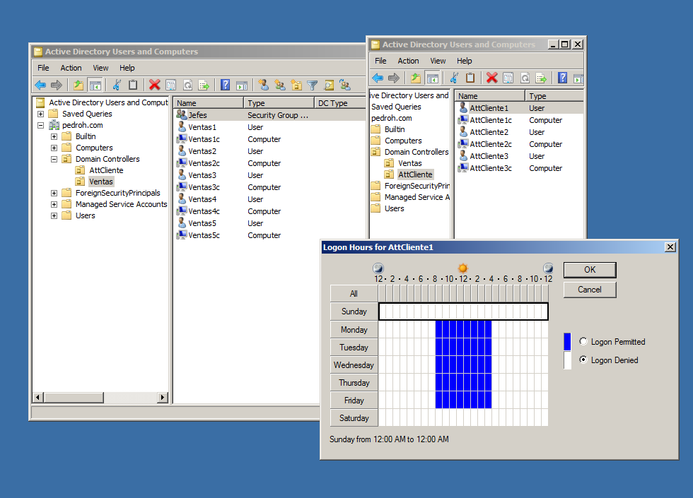
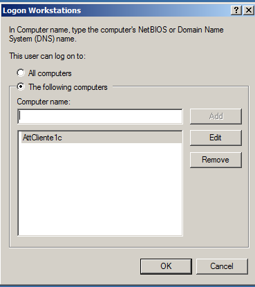

# Windows_Server08

Vamos a crear una  empresa “Pedro H” con 2 departamentos, uno de ventas y otro de atención al cliente, formados por 5 y 3 usuarios respectivamente, repartidos en 2 unidades organizativas. Cada usuario del departamento de ventas podrá iniciar sesión de 8:00 a 16:00.
La empresa contará con una página web.

La unidad organizativa “ventas” tendrá un grupo de Jefes, formado por Ventas1 y Ventas2. Cada usuario de la unidad organizativa tiene un equipo en el que puede entrar con su usuario y contraseña y solo en el horario especificado.

